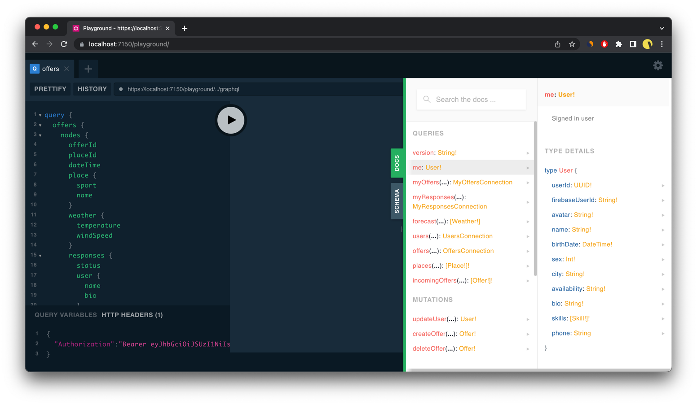

# SportNiteServer - backend service for SportNite

## About
.NET Core-based API service exposing GraphQL interfaces for handling SportNite data

## Architecture
- written in ASP.NET Core (C#)
- data is persisted in MySQL database (connection by Entity Framework Core)
- packed into Docker container
- deployment through Github Actions into Kubernetes cluster on VPS
- integration tests for API (~65% coverage)
- uses https://open-meteo.com/ for weather forecast 
- uses http://overpass-turbo.eu/ data for exposing list of OpenStreetMap sport-related places
- Qodana code quality report: https://qodana.cloud/projects/3PE6p/reports/p4a7W

## Code organization
#### `SportNiteServer` - main project with API and GraphQL interfaces
- `Program.cs` - starting point for entire service. Dependency injection setup, GraphQL schema setup, etc.
- `Dockerfile` - Dockerfile for building container
- `docker-compose.yml` - docker-compose file for local development
- `appsettings.json` - configuration file for local development
- `Services` - module containing business logic code for handling GraphQL queries and mutations
- `Entites` - module containing database entities
- `Database` - module containing database connection setup
- `Migrations` - module containing database migrations
- `Dto` - module containing `DTO`s for GraphQL queries and mutations (`DTO` stands for `Data Transfer Object`) 
- `Assets` - module containing data for seeding database
- `Data` - module containing `Query` and `Mutation` classes for GraphQL schema
- `Exceptions` - module containing custom exceptions and exception handlers
- 
#### `SportNiteServer.Tests` - project containing integration tests for API
- `QueryIntegrationTests.cs` - integration tests for GraphQL queries
- `MutationIntegrationTests.cs` - integration tests for GraphQL mutations

## GraphQL API
In order to explore GraphQL API you can use GraphQL Playground. "Docs" tab (on the right side) shows interactive API explorer.
Some queries/mutations have additional descriptions for better understanding by the developer.



## Building and running

Easiest way to launch service is to utilize docker-compose setup:
```bash
git clone https://github.com/SportNite/SportNiteServer.git
cd SportNiteServer
docker-compose up -d --build
```
After starting up both services (database and server) you can access GraphQL Playground at http://localhost:7150/playground.

## Testing

Assuming dotnet core toolchain is installed and MySQL database is up and running (with empty database 'sportnite' created):

```bash
git clone https://github.com/SportNite/SportNiteServer.git
cd SportNiteServer
dotnet test
```

If you want to change database for testing, create `SportNiteServer/.env` file with following content:

```env
MYSQL_CONNECTION="server=somehost ; port=3306 ; database=somedatabase ; user=someuser ; password=somepassword"
```

## License
Project is licensed under the BSD 3-clause license. See [LICENSE](LICENSE) for more details.
Dependencies licenses are listed in [dependencies-licenses](dependencies-licenses.md) file.